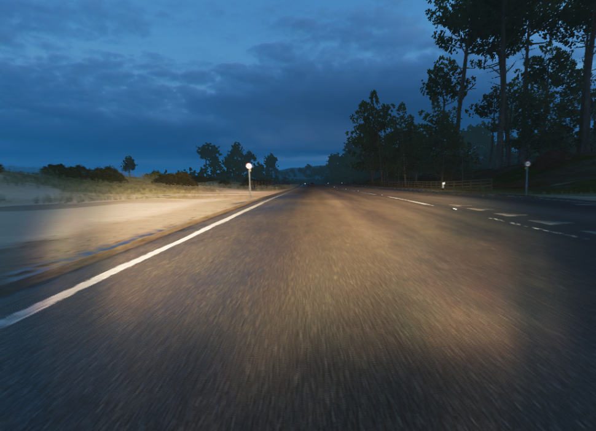

# HorizonNet
My attempt to make a self driving car with deep learning in Forza Horizon 4.
 - developped with Python 3.7
 - works for Windows (FH4 is not on Linux)
 - you need an xbox controller for now

## How to launch
1. To execute just type `python capture.py`.
2. It will then capture, every second approximately, a new image of the game and the inputs from the controller.
3. The neural network is in development ... :)

## Example of a capture
 - Image file `x_image.png`



 - Inputs file `inputs.csv` 

```
imagefile,x,y,gas,brake
0_image.png,-4241,105,34,0
1_image.png,2968,779,101,0
2_image.png,10867,5289,88,0
...
```

`x` and `y` correspond to the coordinates of the joystick on the controller.
